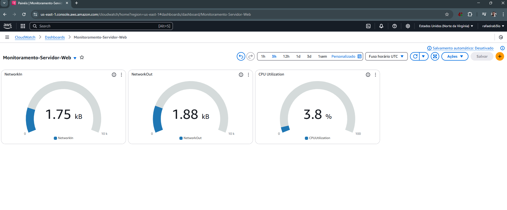

# Provisionamento de Servidor Nginx com Monitoramento na AWS

Este projeto consiste na criação de uma instância EC2 na AWS com o servidor web Nginx instalado, junto com a configuração do CloudWatch para monitoramento básico de métricas como CPU e memória. A instalação é automatizada por meio de um script em Bash.

## Tecnologias utilizadas

- Amazon EC2 (Amazon Linux 2)
- Nginx
- Amazon CloudWatch Agent
- Shell Script (Bash)

## Objetivo

O objetivo deste projeto é demonstrar conhecimentos práticos em provisionamento de infraestrutura na AWS, configuração de serviços, monitoramento básico e automação de processos com scripts.

## Passos principais do projeto

1. Criar uma instância EC2 (t2.micro, Amazon Linux 2)
2. Conectar via SSH na instância
3. Instalar e configurar o Nginx
4. Instalar e configurar o agente do CloudWatch
5. Automatizar os passos acima com um script em Bash
6. Validar o funcionamento do Nginx via navegador
7. Verificar as métricas coletadas no CloudWatch
8. Documentar e versionar o projeto no GitHub

## Como usar

As instruções completas de uso, incluindo o script, serão adicionadas conforme o desenvolvimento do projeto for avançando.

## Estrutura do projeto
```
aws-nginx-cloudwatch/
├── scripts/
│ ├── setup-nginx-monitoring.sh
|  └── amazon-cloudwatch-agent.yaml  
├── images/
│ └── nginx-browser.png
│ └── cloudwatch-metrics.png
├── README.md
```

## Monitoramento com CloudWatch

1. Instalação CloudWatch Agent

Para coletar métricas personalizadas da instância EC2, utilizei o CloudWatch Agent, configurado por meio do wizard interativo.

A configuração foi salva em:

/opt/aws/amazon-cloudwatch-agent/etc/amazon-cloudwatch-agent.yaml

Depois, iniciei o agente com o comando::

sudo /opt/aws/amazon-cloudwatch-agent/bin/amazon-cloudwatch-agent-ctl -a start -m ec2 -c file:/opt/aws/amazon-cloudwatch-agent/etc/amazon-cloudwatch-agent.yaml -s

Após isso, criei um dashboard no CloudWatch com os principais gráficos do tipo "medidor" para:

CPU Utilization
Network In
Network Out

Segue a imagem do dashboard:



